# Mermaid 语法速查

> Agent 生成 Mermaid 代码时参考本文件。

## 流程图 (Flowchart)

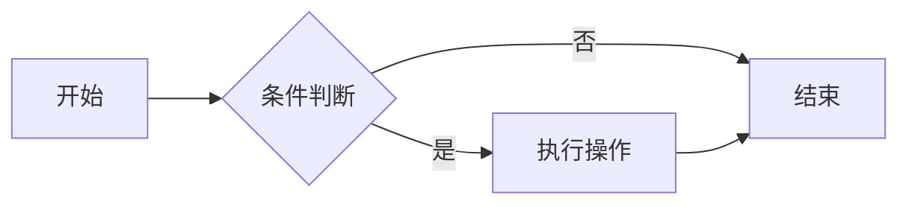

方向: `TB`(从上到下), `TD`, `BT`, `LR`(从左到右), `RL`

节点形状:
- `[文本]` 矩形
- `(文本)` 圆角矩形
- `{文本}` 菱形
- `([文本])` 体育场形
- `[[文本]]` 子程序
- `[(文本)]` 圆柱形
- `((文本))` 圆形
- `>文本]` 旗帜形

连接:
- `-->` 箭头
- `---` 无箭头
- `-.->` 虚线箭头
- `==>` 粗箭头
- `-->|标签|` 带标签的箭头

子图:
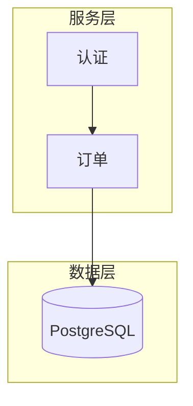

## 时序图 (Sequence Diagram)

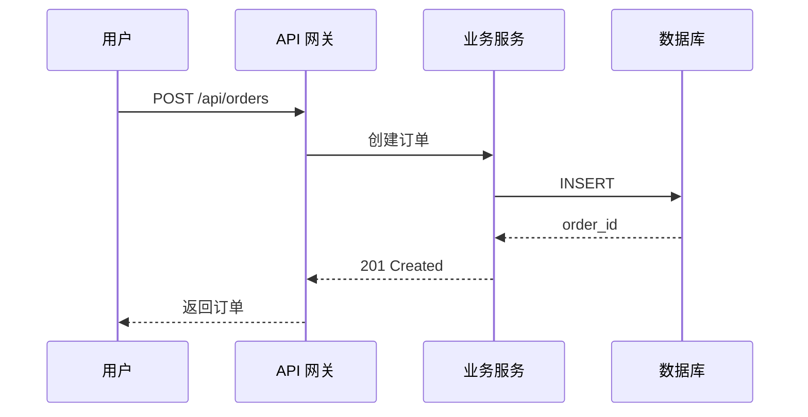

箭头:
- `->>` 实线箭头
- `-->>` 虚线箭头
- `-x` 实线叉
- `--x` 虚线叉

高级:
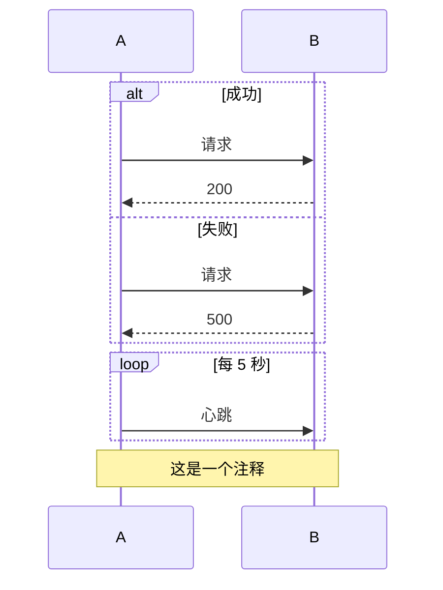

## ER 图 (Entity Relationship)

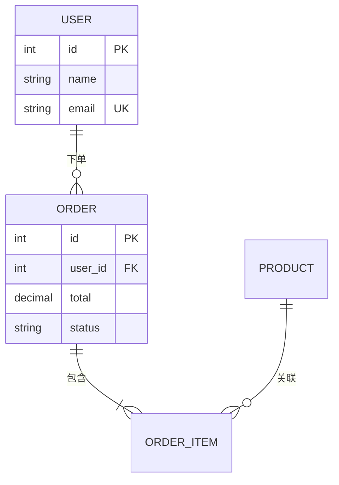

关系:
- `||--||` 一对一
- `||--o{` 一对多
- `o{--o{` 多对多

## 类图 (Class Diagram)

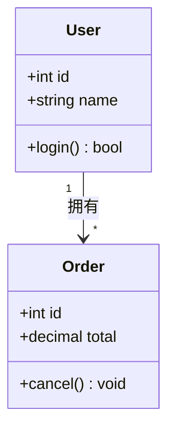

## 状态图 (State Diagram)

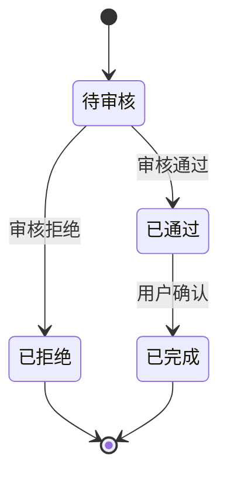

## 甘特图 (Gantt)

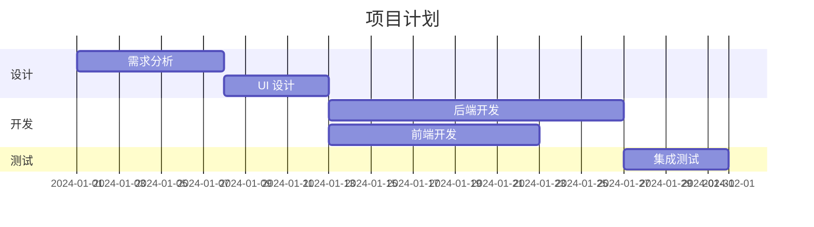

## 饼图 (Pie)

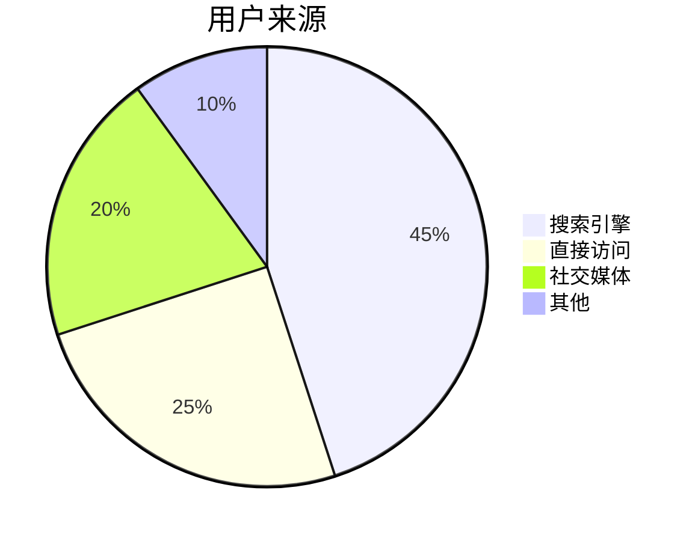

## 思维导图 (Mindmap)

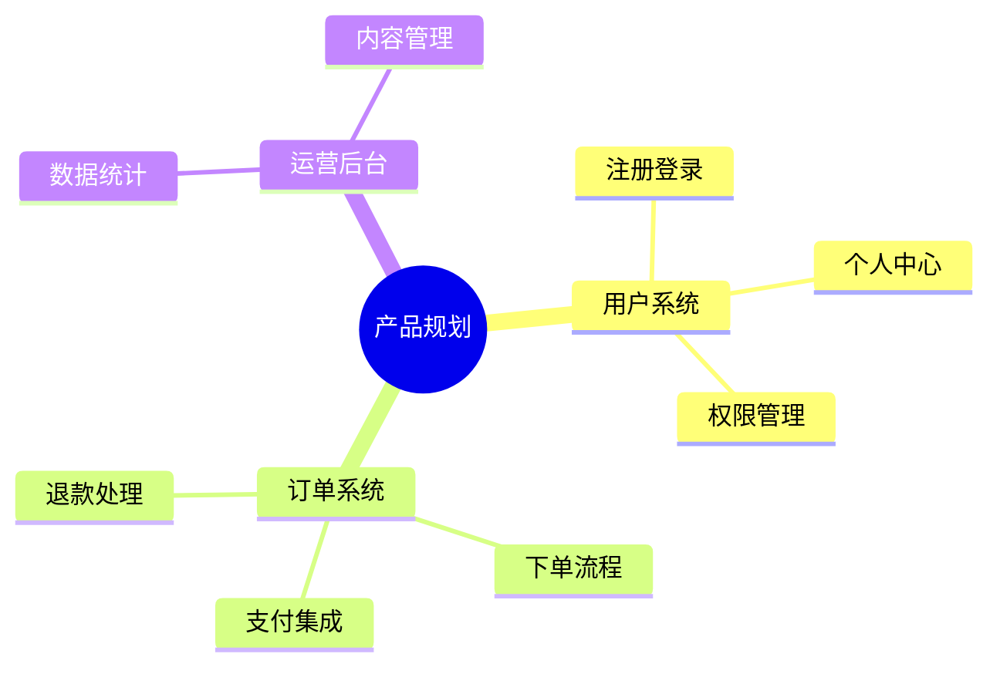

## 时间线 (Timeline)

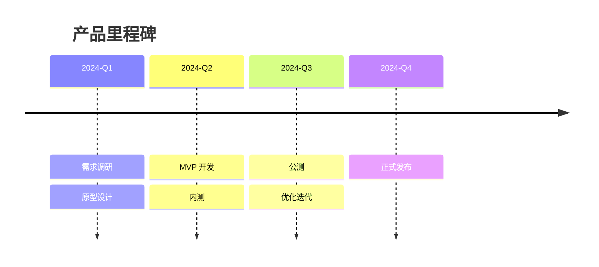

## Git 图 (Gitgraph)

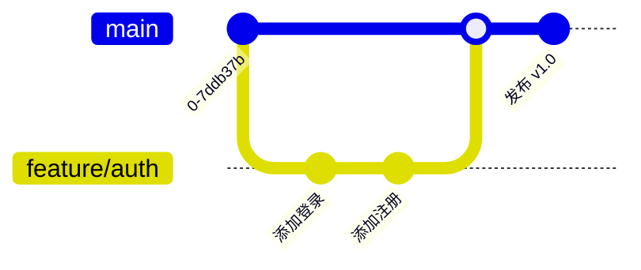

## 用户旅程图 (User Journey)

PM 高频场景：用户体验梳理、触点分析、满意度评估。

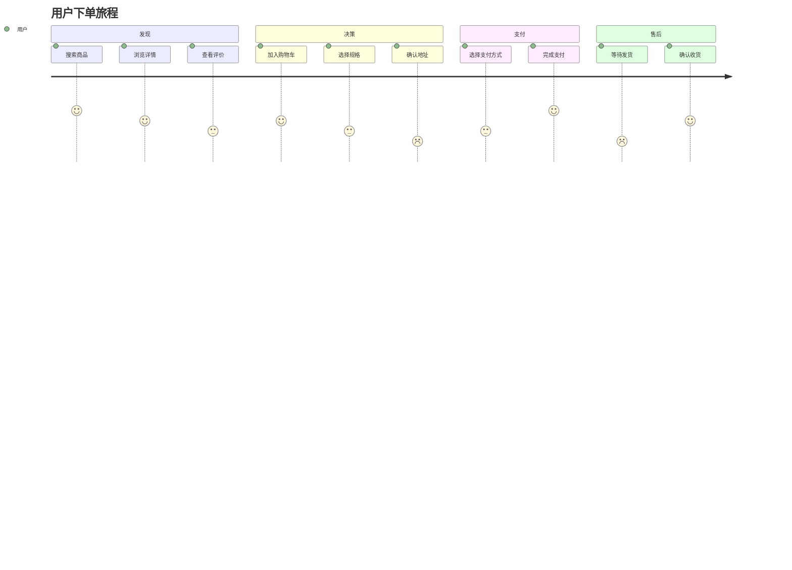

分数 1-5 表示满意度（1=沮丧，5=满意）。每个步骤格式: `描述: 分数: 角色`

## 象限图 (Quadrant Chart)

PM 高频场景：需求优先级排序（影响力×成本）、竞品定位、功能评估。

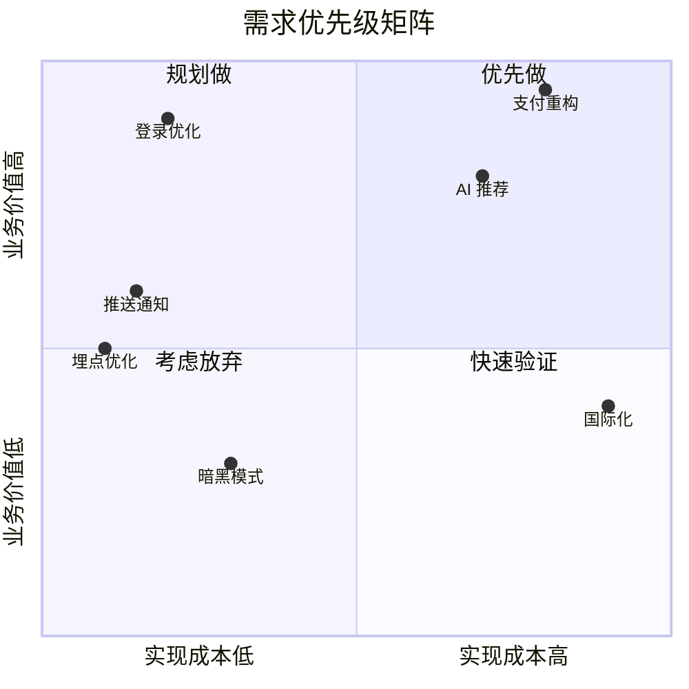

坐标 `[x, y]` 范围 0~1。象限编号：1=右上 2=左上 3=左下 4=右下

## XY 图表 (XY Chart)

PM 高频场景：趋势分析、数据对比、指标追踪。

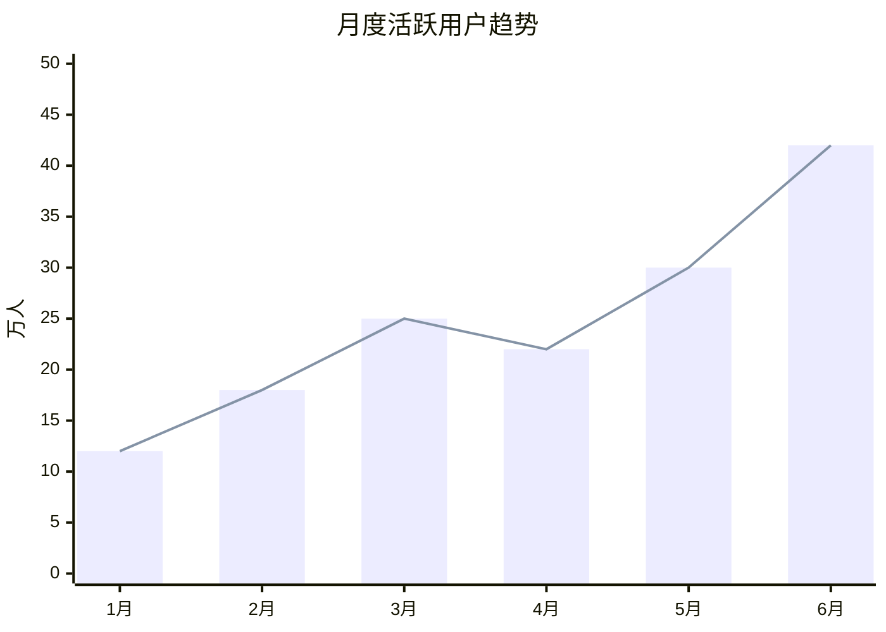

支持 `bar`（柱状图）和 `line`（折线图）叠加显示。

## 桑基图 (Sankey)

PM 高频场景：用户漏斗分析、流量分布、转化路径。

```mermaid
sankey-beta

首页,搜索页,5000
首页,分类页,3000
首页,跳出,2000
搜索页,商品详情,4000
搜索页,跳出,1000
分类页,商品详情,2500
分类页,跳出,500
商品详情,下单,3500
商品详情,跳出,3000
下单,支付成功,3000
下单,放弃支付,500
```

格式: `来源,目标,数值`（每行一条流向），无需缩进。
## Block 图 (Block Diagram)

PM 高频场景：系统模块划分、信息架构、页面结构。

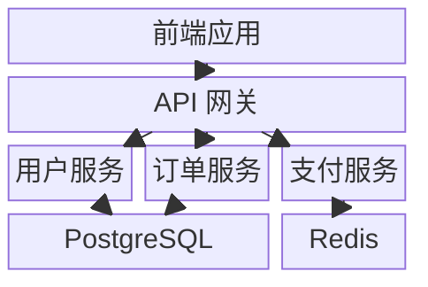

`columns N` 定义列数，`:N` 指定跨列数。块之间用 `-->` 连接。

## C4 架构图 (C4 Diagram)

PM 高频场景：系统架构概览、技术方案评审、上下文边界。

### Context（系统上下文）

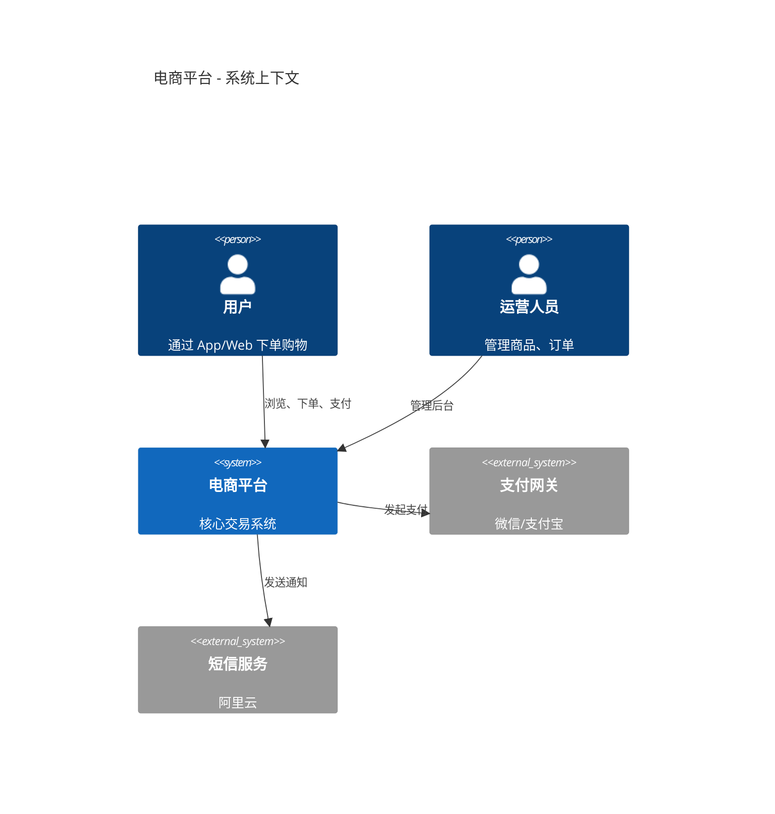

### Container（容器视图）

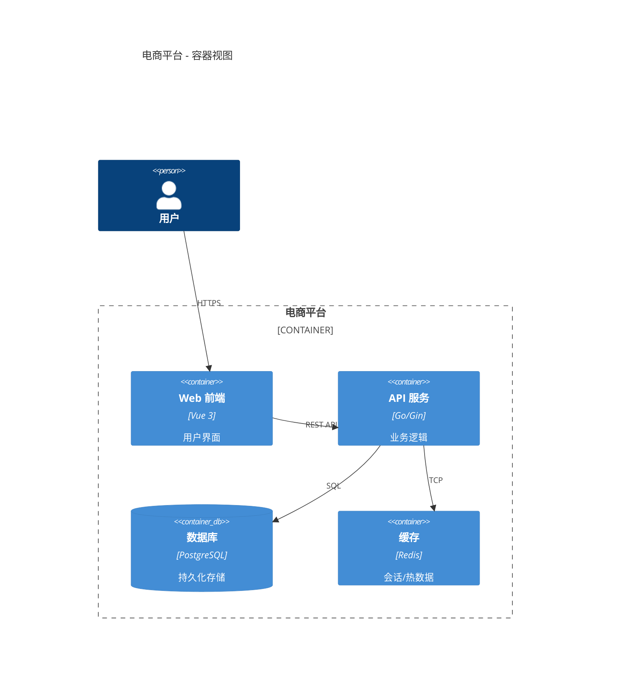

核心元素:
- `Person(id, name, desc)` — 用户角色
- `System(id, name, desc)` / `System_Ext(...)` — 内部/外部系统
- `Container(id, name, tech, desc)` / `ContainerDb(...)` — 容器
- `Rel(from, to, label)` — 关系


## 注意事项

1. 子图内容必须缩进
2. 节点文本含 `()` `{}` 时用引号包裹: `A["含(括号)的文本"]`
3. 中文完全支持，无需特殊处理
4. `A[显示文本]` — A 是 ID（用于连接），方括号内是显示文本
5. 流程图必须用 `flowchart` + 方向（`LR`/`TB`），不要用废弃的 `graph`
6. C4 图中 `_Ext` 后缀表示外部系统，`_Boundary` 用于分组
7. Block 图中 `:N` 控制跨列，`columns N` 定义网格列数
8. **手绘风格 (handDrawn)** 支持: flowchart、stateDiagram、sequence、class、er、mindmap、timeline、journey、pie。**不支持**: C4、xychart、sankey、gantt、gitGraph、block（Mermaid 限制，未来可能扩展）
